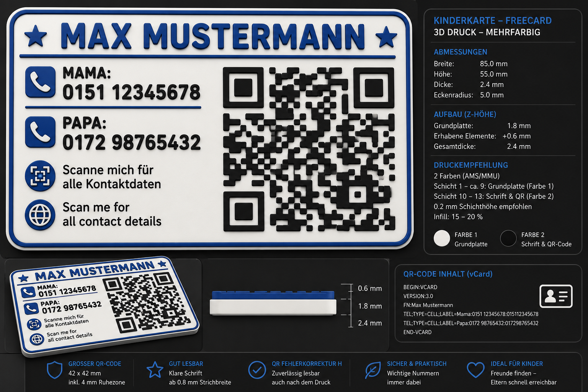

# FreeCard Kids

**Open Source 3D printable contact cards for children made with FreeCAD.**



FreeCard Kids generates customizable 3D-printable contact cards for children.

The generated cards are optimized for multi-color FDM printing and include:

* Rounded corners
* Large QR Code
* Parent phone numbers
* Bilingual information text
* Parametric design
* STL export
* 3MF export
* FreeCAD project generation

---

## Features

* 📇 ISO/IEC 7810 ID-1 card size (85.60 × 53.98 mm)
* 🟢 Parametric design
* 📱 Large QR code
* 👩 Parent phone numbers
* 👨 Parent phone numbers
* 🌍 German / English
* 🖨️ Optimized for AMS / MMU multi-color printing
* ❤️ Completely Open Source

---

## Example Layout

```text
╭────────────────────────────────────────────╮
│               MAX MUSTERMANN               │
│                                            │
│ 📱 Mama: 0151 12345678                     │
│ 📱 Papa : 0172 98765432                    │
│                                            │
│ Scanne mich für alle Kontaktdaten          │
│ Scan me for all contact details            │
│                            ████████████    │
│                            █ QR CODE  █    │
│                            ████████████    │
╰────────────────────────────────────────────╯
```

---

## Roadmap

### Version 0.1

* Card generator
* Rounded corners
* Frame
* Text layout

### Version 0.2

* QR-Code generator
* Icons
* STL export

### Version 0.3

* 3MF export
* Templates
* Themes

### Version 1.0

* FreeCAD Workbench
* GUI
* Addon Manager support

---

## Lizenz (nicht-kommerziell)
Dieses Projekt steht unter einer **nicht-kommerziellen Lizenz**: Du darfst das Material nutzen, teilen und auch bearbeiten, aber **keine kommerzielle Nutzung** ist erlaubt.

## Was umfasst die Lizenz?
- Text
- Bilder
- FreeCAD-Dateien (.FCStd)
- Code

## Namensnennung
Bei Weitergabe oder in abgeleiteten Werken musst du **Autor/Quelle nennen**:
- Autor: Carsten Müller
- Quelle: https://github.com/nosilam/FreeCard-Kids

## Ausschluss kommerzieller Nutzung
Kommerzielle Nutzung ist nicht gestattet, insbesondere nicht:
- für Verkauf, Vermarktung oder Werbe-/Werbekooperationen,
- im Rahmen kostenpflichtiger Dienstleistungen oder Produkte,
- wenn die Nutzung darauf abzielt, direkt oder indirekt Geld zu verdienen.

## Weitere Hinweise
Eine vollständige Lizenzbeschreibung findest du in der Datei **LICENSE** im Repository.

---

© 2026 Carsten Müller
